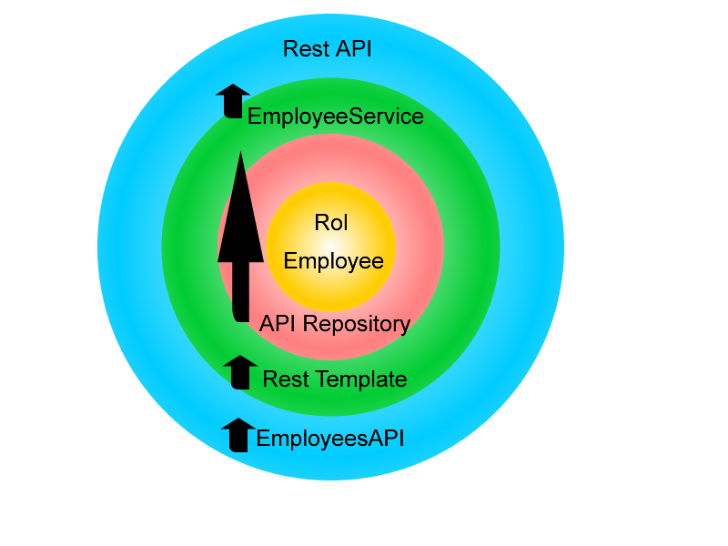

# Employees Salary Challenge
 Employees application calculates the annual salary depending on their contract type.
 
 
 
 It's developed to follow a Domain-Driven Design approach, I  used techniques like TDD and best practices like SOLID principles.
 
  * How Run this App:
     - 
       You will need to first build with Maven; use the below command, please run it from the project folder which contains the pom.xml file.
       ```
       mvn package
       ```
       To run Employees app from a command line in a Terminal window you can run the java -jar command. This jar is provided where the Employee app was packaged as an executable jar file.
       ```
       java -jar target/demo-0.0.1-SNAPSHOT.jar
       ```       
  * Documentation and Endpoints:
     - 
 

   Now you are be able to see the Swagger documentation about REST API
       
   ```
   http://localhost:5000/swagger-ui.html#/application-controller
   ```
   Also you can see the profiles view, for example
       
   ```
   http://localhost:5000/view-employees
   ```       


  Also this app is running in my personal AWS service:
  ```
  http://employeechallenge-env.eba-92twvvp4.us-east-2.elasticbeanstalk.com/view-employees
  ```
API
  ```
  http://employeechallenge-env.eba-92twvvp4.us-east-2.elasticbeanstalk.com/employees
  ```
Swagger
  ```
  http://employeechallenge-env.eba-92twvvp4.us-east-2.elasticbeanstalk.com/swagger-ui.html#/application-controller
  ```
 * Technologies:
    - 
     
    
  + FrontEnd
        It's a simple html view based on Jquery and  Bootstrap
        
  + BackEnd
  It's a RestFull API developed with Java 8, using SpringBoot framework, Rest template to connect with Employees API repository and Swagger 2 for the documentation.
 
 * To Do List:
    - 
    -Create  cache in rest template in order to improve performance.
    
    
             
